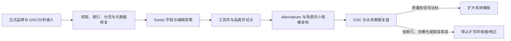

# AI 导航站 SEO 审计、竞品策略与 90 天优化计划

> 研究对象：`https://dir.vastnext.com`
> 审计日期：2026-08-21
> 竞品基线：2026-08-18，1,864 条 DuckDuckGo 查询 × Top 10 SERP，覆盖 14,463 个工具

## 执行摘要

当前站已经具备可访问的 Next.js 页面、Sanity 内容库、canonical 和 1,105 个工具页，但还不具备可持续扩展 SEO 的基础。综合评分约为 **1.8/5**。最严重的问题不是页面数量不足，而是线上仍明确展示 Mkdirs 模板演示内容：站名为 `Directory`，首页 H1 是 `The Best Directory Website Template`，description、作者、社交和页脚也都在介绍 Mkdirs。这使搜索引擎和用户看到的主题不是“AI 工具导航”，而是“目录模板演示”。

第二组问题来自索引治理。当前 sitemap 有 **1,372 个 URL**，其中工具页 1,105 个、分页 URL 220 个，还包含 `/search`、登录和注册页；静态 URL 的 `lastmod` 使用生成时刻，分页控件在服务器 HTML 中没有真实 `href`。页面虽然能访问，却没有清晰回答“哪些 URL 值得进入搜索结果、深层内容如何被稳定发现、分页和参数如何规范化”。

竞品调查表明，高可见度目录并非只靠规模。TopAI.tools 用结构化字段、验证、alternatives、用例和 Playbooks 构成决策闭环；FutureTools 用人工策展、个人品牌、商业披露和 Newsletter 建立信任与回访；Creati.ai 用 alternatives/vs 覆盖高意图长尾；Toolify 用流量和增长数据制造独特榜单。当前站已有足够的工具库存，真正缺少的是价格、平台、输入输出、适用人群、限制、核验日期、编辑政策、比较页和场景页。

因此，未来 90 天不建议继续无差别导入工具或批量生成页面。建议采用以下顺序：

1. **0—30 天**：正式品牌上线、接入 GSC/分析、清理 sitemap/noindex/canonical、修复可抓取分页、完成内容盘点。
2. **31—60 天**：扩展 Sanity 字段和编辑政策，深度更新 50—100 个工具与 5—8 个核心品类，添加可靠结构化数据。
3. **61—90 天**：只试点 10—20 个 alternatives 和 3—5 个场景指南，以 GSC 的发现、索引、曝光、点击和业务转化决定是否扩展。

成功标准不应是“发布了多少页”，而应是“多少合格页被索引、获得非品牌查询并产生官网外跳、订阅或投稿等业务行为”。

## 一、研究范围与限制

### 研究材料

- 当前线上首页、工具页、分类页、`robots.txt` 和全量 `sitemap.xml`。
- 当前 Next.js 14 + Sanity 代码中的站点配置、Metadata、robots、sitemap、分页、图片配置和内容 schema。
- 用户提供的竞品 SERP 报告，以及 TopAI.tools、FutureTools、Creati.ai、Toolify、AI Tool Ranks 等代表页面。
- Google Search Central 与 Next.js 14 官方规范。

### 证据边界

- 没有 Google Search Console，因此不能确认 Google 实际索引数、排除原因、canonical 选择和真实查询。
- 没有 GA 或业务事件，因此不能计算自然流量和转化。
- 没有 Ahrefs/Semrush 等付费数据库，因此不能给出可靠搜索量、关键词难度和外链差距。
- 竞品排名基线来自 DDG 单次快照，只适合发现相对机会，不等于 Google 流量。
- 没有 CrUX/PageSpeed 实测，性能部分只能指出配置风险，不能断言 Core Web Vitals 不合格。

报告中的试点规模和内容门槛是风险控制建议，不是 Google 官方排名阈值。接入 GSC 后应根据首个 28 天数据校准。

## 二、当前站点 SEO 审计

### 2.1 现状评分

| 维度 | 评分（5 分制） | 判断 |
|---|---:|---|
| 可抓取性 | 3.0 | 页面与 sitemap 可访问，但分页无真实 href，深层发现过度依赖 sitemap |
| 索引控制 | 1.5 | search/auth/弱聚合页缺少明确 noindex 与 sitemap 准入规则 |
| URL 与 canonical | 2.5 | 核心页有 canonical，分页和参数规则未完整，OG URL 固定首页 |
| 搜索展示元数据 | 1.0 | 站名、描述、作者和首页内容仍为 Mkdirs 模板演示 |
| 页面内容与意图 | 2.0 | 工具页有基础模块，首页和分类页缺正式定位与差异化选择内容 |
| 内部链接 | 2.0 | 有分类、标签和推荐，但分页不可抓取，主题集群较弱 |
| 结构化数据 | 0.5 | 未发现 JSON-LD；面包屑仅为可视组件 |
| 性能可验证性 | 2.0 | 图片优化被禁用，缓存可能有风险，但缺现场数据 |
| **综合** | **1.8/5** | 当前更像“已导入数据的模板演示站” |

### 2.2 关键基线

| 项目 | 当前值 | 含义 |
|---|---:|---|
| Sitemap URL 总数 | 1,372 | 已有不小的索引候选集合 |
| 工具详情页 | 1,105 | 规模不是短板，质量与字段才是短板 |
| 分页 URL | 220 | 占 sitemap 约 16.0%，需要独立 canonical 与价值判断 |
| 分类相关 URL | 84 | 17 个分类及其分页 |
| 标签相关 URL | 143 | 18 个标签及其分页，需防止分类/标签近重复 |
| Search/Auth URL | 3 | 不应进入 sitemap，通常应 noindex |
| JSON-LD | 0 个抽样页发现 | 缺 Organization/WebSite/Breadcrumb 等机器可读实体信号 |
| 公开 `site:` 可见结果 | 未观察到 | 弱信号，不能替代 GSC |

### 2.3 问题优先级

| 优先级 | 问题 | 影响 | 责任表面 | 验收方式 |
|---|---|---|---|---|
| P0 | 全站仍为 Mkdirs/demo 品牌 | 主题与实体错误，影响全站质量和点击意愿 | `src/config/site.ts`、首页、导航、页脚、OG 资产 | 核心 HTML 不再出现 Mkdirs/demo；Title/H1/description 对齐 AI 导航定位 |
| P0 | Search/Auth 进入 sitemap 且无 noindex | 扩大低价值索引集合、浪费抓取 | `src/app/sitemap.ts`、相关 metadata | sitemap 不含这些 URL；页面输出 `noindex, follow` |
| P0 | 分页无 `<a href>` | 深层工具发现不稳定 | `src/components/shared/pagination.tsx` | 禁用 JS 仍能顺序翻页；链接返回 200 |
| P0 | `lastmod` 使用运行时当前时间 | 制造不真实更新信号 | `src/app/sitemap.ts`、CMS 更新时间 | 未更新页面连续请求 lastmod 不变；无法计算则省略 |
| P1 | 分页、筛选、排序缺统一 canonical/index 规则 | 近重复、参数膨胀与信号分散 | 页面 metadata、sitemap 查询 | 分页自引用 canonical；非目标参数 noindex 且不进 sitemap |
| P1 | 分类页 H1 与正文薄弱 | 难以承接品类比较意图 | 分类 schema 与模板 | 使用具体 H1；加入选择标准、精选、子场景和 FAQ |
| P1 | 工具页缺决策字段与核验 | 与其他目录同质，存在薄页/错误事实风险 | Item schema、编辑流程、工具模板 | 有价格、平台、输入输出、来源、核验日期、适用人群和替代品 |
| P1 | 无结构化数据 | 站点实体、层级和工具属性难被机器稳定理解 | 根布局、面包屑、工具模板 | 校验通过且 JSON-LD 与可见内容一致 |
| P2 | `og:url` 固定首页，Twitter 字段错误 | 分享预览与 canonical 不一致 | `src/lib/metadata.ts` | OG URL 等于当前 canonical；账号字段真实或省略 |
| P2 | 图片优化关闭、缓存策略风险 | 可能影响 LCP、带宽和抓取效率 | `next.config.mjs`、图片与响应头 | 以 PageSpeed/CrUX 基线验证改善 |

### 2.4 页面模板判断

**首页**：主要问题不是字数少，而是搜索意图完全错误。应明确站点帮助谁发现什么工具、覆盖多少经过核验的工具和品类、如何选择与更新，并链接核心品类、精选工具、最新核验和编辑政策。

**工具页**：已有 description、Key Features、Use Cases、分类、标签和推荐，是可用基础；需要加入结构化决策字段、官方来源、核验日期、编辑责任和 alternatives。不要展示无法证明的评分、评论或“tested”。

**分类页**：Title/description 能指向主题，但抽样 H1 仅为 `Category`，正文接近工具列表。应改成具体主题，并加入原创导语、选择维度、精选、子场景、FAQ 和更新时间。

**标签页**：仅保留稳定、用户可理解、与分类不重复的 taxonomy。自由标签和库存过少标签不应自动进入 sitemap。

**分页页**：分页 URL 可以被索引，但必须有真实 href、独立 URL、自引用 canonical 和可解释价值。深分页是否保留应结合 GSC 索引与曝光决定，而不是一律删除。

## 三、竞品 SEO 策略与差距

用户报告显示：`creati.ai` 覆盖 297 个查询，`topai.tools` 289 个，`toolify.ai` 129 个，`aitoolranks.com` 93 个；TopAI.tools 同时获得品牌工具词和 alternatives 覆盖，而多个目录主要依赖品牌工具词。PCMag 等媒体在品类词上更强，说明泛 “best” 查询需要编辑权威与实测，不能只靠目录模板。

### 3.1 竞品策略矩阵

| 站点 | 主要基盘 | 核心页面 | 独特价值 | 当前站可借鉴 | 不宜照搬 |
|---|---|---|---|---|---|
| TopAI.tools | 品牌词 + alternatives | 工具、品类派生、用例、比较、Top 100、Playbook、Deals | 结构化字段、任务发现、价格验证和完整决策链 | 作为工具字段、IA 和 alternatives 的主参照 | 23K 工具和复杂 AI 搜索不适合 90 天复制 |
| FutureTools | 品牌词 + 品牌/直接流量 | 精选工具、Top 20、新闻、视频、评论、Newsletter | Matt Wolfe 个人权威、人工策展、250K 分发 | 编辑政策、精选榜、更新时间、披露 | 个人 IP 和媒体规模不可快速复制 |
| Creati.ai | 品牌词 + 比较长尾 | 工具、alternatives、A vs B | 大量具体购买决策页与交叉内链 | 小规模高价值比较页 | 未核验字段下批量生成会放大错误 |
| Toolify | 品牌词 + 数据榜单 | 超大目录、459 分类、流量/增长排名 | 把流量数据变成独特内容资产 | 可解释榜单和趋势维度 | 数据成本、准确性和规模要求高 |
| AI Tool Ranks | 品牌长尾 | Reviews、Features、Pricing、Pros/Cons、Similar | 标准化模块和搜索标题 | 可参考模块，不参考质量 | 抽样页面存在不确定转述与自动化痕迹 |
| 当前站 | 尚无可观察可见度 | 工具、分类、标签、集合 | 已有 1,105 工具和 Sanity 基础 | 可直接深度化既有实体 | 品牌、字段、验证、决策页和编辑政策均缺 |

### 3.2 真正可复用的竞争机制

1. **工具实体深度**：价格、免费方案、平台、输入输出、功能、用例、适用/不适用人群、限制、来源和核验日期。
2. **品类选择价值**：不是“更多工具”，而是选择标准、关键差异、编辑精选和约束型子意图。
3. **Alternatives 决策页**：解释为什么替换、按场景推荐、对称比较并回链工具实体。
4. **可解释榜单**：公开 Editor’s Picks、Recently Verified、New Tools 的选择和排序规则，不伪造流量或评分。
5. **编辑信任**：公开收录、验证、更新、下架、赞助/联盟和 AI 辅助政策。
6. **回访机制**：新工具、月度精选、更新简报和 Newsletter，让 SEO 页面连接直接受众。

### 3.3 当前站的关键差距

当前站与领先竞品的差距不是 1,105 与 20,000 个工具之间的数量差，而是以下链路缺失：

```text
用户问题
  -> 有明确选择标准的品类/场景页
    -> 有可验证字段的工具页
      -> 有对称数据的 alternatives/比较页
        -> 有更新与披露的编辑机制
          -> Newsletter/榜单促成回访
```

在这个链路形成前，继续扩充 URL 会增加维护成本和低价值索引风险，而不会自动形成竞争力。

## 四、关键词与页面机会

### 4.1 关键词到页面类型映射

| 意图/词型 | 示例 | 主页面类型 | 必备内容 | 90 天优先级 |
|---|---|---|---|---|
| 品牌工具查找 | `meshy ai`、`chatgpt features` | `/item/{slug}` | 定位、功能、用例、价格、平台、输入输出、适用人群、来源、核验日期 | P0 |
| 窄品类发现 | `AI writing assistants`、`AI text to speech tools` | 增强 `/category/{slug}` | 独特 H1/导语、选择标准、比较表、精选、子场景、FAQ | P1 |
| 角色/任务 | `AI tools for educators`、`AI tools for real estate agents` | 编辑集合/指南页 | 工作流拆解、任务分组、推荐理由、限制和相关品类 | P1/P2 |
| 替代方案 | `Midjourney alternatives`、`AssemblyAI alternatives` | `/item/{slug}/alternatives` | 替换原因、对称比较、场景推荐、核验日期 | P1 |
| 两两比较 | `Midjourney vs Stable Diffusion` | `/compare/{a}-vs-{b}` | 价格、平台、优缺点、场景结论、来源与更新日期 | P2，字段齐全后 |
| 约束型品类 | `free AI image generators`、`open source speech to text` | 经审核派生页 | 可验证约束、足够库存、独立导语与复核流程 | P2，禁止任意 faceted indexing |
| 趋势/新鲜度 | `latest AI tools`、`new AI tools` | `/new` 或可解释榜单 | 真实发布日期/核验日期、排序规则和变更记录 | P2 |
| 泛目录品牌 | `AI tools directory`、`best AI tools` | 首页 + 方法/About | 清晰价值、覆盖范围、编辑规则、代表品类和数据透明 | 长期主题 |

### 4.2 建议的首批页面组合

| 波次 | 目标 | 建议规模 | 发布前提 |
|---|---|---:|---|
| Wave 1 | 高认知工具实体深度化 | 50—100 页 | 官网有效、字段完整、能核验价格/功能/平台 |
| Wave 2 | 核心窄品类选择页 | 5—8 页 | 每页至少约 8—12 个合格工具，有独立选择框架 |
| Wave 3 | 高意图 alternatives | 10—20 页 | 每页至少 5 个真正替代项，对称字段完整 |
| Wave 4 | 角色/任务指南 | 3—5 页 | 能按工作流组织多个已核验工具 |
| Wave 5 | vs/约束派生页 | 小规模实验 | 字段、更新流程和 GSC 信号成熟后 |

这些数量是试点上限，不是必须完成的发布配额。质量门未通过时宁可不发布。

### 4.3 首批品类候选

建议优先核验现有库存是否能支撑：

- AI image generators / image generation tools
- AI writing assistants / AI writing tools
- AI education tools / AI tools for educators
- AI text-to-speech tools
- AI resume builders
- AI headshot generators（只有在真实测试或充分决策数据存在时）

公开结果页显示，“best AI writing tools”“best AI headshot generator”等查询通常由实际测试、价格核验、明确评分标准和作者判断支撑。当前站若没有实测，不应使用 “tested” 或虚构评分，可以诚实定位为 “Compare AI … tools” 或目录选择指南。

### 4.4 必须剔除或人工复核的候选词

- 残缺：`ai tool`、`ai note taking tool`、`ai`、`easily`、`ai for`。
- 实体不清：`fiber ai`、`whisper ai`、`flow ai` 等需先消歧。
- Reddit 导航词：`best ai education tool reddit` 等不应直接做伪 Reddit 页面。
- 过宽：`best ai tool for business`、`ai for small business owners`、`free ai tools` 应拆成具体任务和约束。
- 强事实修饰词：free、API、open source、mobile app 必须有独立字段和定期核验，不能靠标签猜测。

### 4.5 页面发布准入门

| 页面类型 | 数据/库存门槛 | 独特价值门槛 | 不满足时 |
|---|---|---|---|
| 工具页 | 核心字段完整、官网有效、关键事实有来源 | 人工核验定位、功能、用例、适用人群、更新日期 | 草稿、不进 sitemap 或 noindex |
| 分类页 | 至少约 8 个合格工具，建议 12+ | 独特导语、4+ 选择维度、精选/比较和 FAQ | 仅导航或 noindex |
| 场景页 | 至少 6 个跨品类合格工具 | 工作流拆解、选择理由和限制，不复制分类文案 | 保持草稿 |
| Alternatives | 至少 5 个真实替代项 | 对称字段、替换原因、场景结论和核验日期 | 只显示相似工具，不建索引页 |
| Vs | 两个工具均完成深度核验 | 对称表格、差异、价格、优缺点和结论 | 不生成 |
| 约束派生页 | 至少 8 个明确满足约束的工具 | 验证方法、独特推荐和复核机制 | 作为筛选功能但 noindex |

### 4.6 主题集群与内链

```text
首页 / AI Tools Directory
  -> 核心品类
    -> 场景/约束页（仅通过准入者）
      -> 工具实体页
        -> Alternatives / Compare
          -> 回链品类、场景与相关工具
```

所有层级应使用真实 HTML `<a href>`。工具页至少链接主品类、真实用例和 3—5 个替代品；alternatives 页必须链接原工具和全部候选；品类页链接精选工具、场景和窄品类。Breadcrumb JSON-LD 应与可见层级一致。

## 五、90 天优化计划

### 5.1 依赖关系



技术修复与内容盘点可以并行；批量发布不能早于品牌、索引规则、schema 和编辑流程。

### 5.2 0—30 天：建立正式站点基础

| 工作流 | 交付 | 验收 |
|---|---|---|
| 品牌与首页 | 正式站名、价值主张、作者/组织、邮件、社交、OG 资产；替换模板文案 | 核心 HTML 0 处 Mkdirs/demo；首页意图对齐 AI 工具发现 |
| 测量 | GSC Domain Property、sitemap 提交、GA4/同类分析、关键业务事件 | 能读取 Page Indexing、Performance、Sitemaps；记录 Day 0 基线 |
| Sitemap | 移除 search/auth/protected；lastmod 真实或省略；按页面类型拆分 | 只含 200、canonical、indexable URL；未更新页 lastmod 不变 |
| Noindex/参数 | Search/Auth/后台 noindex；定义分页、排序和筛选规则 | 目标页面 robots 正确；分页自引用 canonical；参数矩阵留档 |
| 分页 | 改为 Next Link/真实 href | 禁用 JS 仍可翻页；无越界和重复 URL |
| Metadata | 修复 OG URL 和 Twitter 字段 | 首页/工具/分类/分页抽样一致 |
| 内容盘点 | 导出 1,105 页字段完整度、重复、失效链接和更新时间 | 形成 publish/index/noindex/draft 状态清单 |
| 性能基线 | 测首页、工具、分类的移动端 LCP/INP/CLS、TTFB、图片字节 | 报告留档，为图片/缓存优化提供基线 |

**阶段退出条件**：正式品牌发布；P0 技术问题修复；GSC 可用；首批 50—100 工具和 5—8 品类名单有数据依据。

### 5.3 31—60 天：建设可验证页面价值

| 工作流 | 交付 | 验收 |
|---|---|---|
| Item schema | pricing/free plan、platform、input/output、bestFor、limitations/pros/cons、officialSource、verifiedAt、editor | `pnpm typegen` 和构建通过；字段有来源与校验 |
| Category/Collection schema | editorial intro、selection criteria、FAQ、reviewedAt、featured items、index 状态 | 索引页满足库存和独特内容门槛 |
| 编辑政策 | 收录、验证、更新、下架、赞助/联盟、AI 使用规则 | 公开可访问；工具页展示核验责任信息 |
| 工具页试点 | 深度更新 50—100 页 | 90%+ 必填字段完整；官网和关键事实抽样有效 |
| 品类页试点 | 升级 5—8 页 | 具体 H1、选择框架、精选、子场景和 FAQ，导语不复制 |
| 结构化数据 | Organization/WebSite、BreadcrumbList；条件成熟再试 SoftwareApplication | Validator/Rich Results Test 无关键错误；无虚构 rating/review |
| 图片与缓存 | 评估恢复优化或生成图片变体；修复公开页不必要 no-store | 关键模板图片字节/LCP 改善且无功能回归 |

**阶段退出条件**：工具和品类试点达到数据与编辑门槛；结构化数据有效；GSC 开始返回索引/查询数据。若仍无信号，先诊断，不进入扩页。

### 5.4 61—90 天：验证高意图增长模型

| 工作流 | 交付 | 验收 |
|---|---|---|
| Alternatives | 10—20 页 | 每页 5+ 真实替代品、对称字段、场景结论、核验日期和双向内链 |
| 场景指南 | 3—5 页 | 按工作流组织，包含选择理由和限制，不冒充实测 |
| 内链集群 | 首页—品类—场景—工具—alternatives 双向连接 | 爬虫渲染有 href，无孤儿索引页 |
| 更新机制 | 每周链接/价格抽查、每月重点页更新、变更记录 | 核验 SLA 达标，失效工具及时下架或标注 |
| 分发与权威 | 月度精选/新工具简报、Newsletter、可引用的数据透明页 | 产生真实订阅、提及或自然链接，不购买垃圾链接 |
| 复盘 | 按页面类型比较索引、曝光、点击、CTR、查询、转化和维护成本 | 决定扩大、修改或停止每种模板 |

**阶段退出条件**：至少一个页面类型出现持续非品牌曝光或点击，或能清楚定位未获得信号的原因；只有通过质量和数据门的模板才能继续扩展。

## 六、指标与验收机制

### 6.1 Day 0 基线

立即记录：

- 当前 sitemap 1,372 URL、工具 1,105、分页 220、search/auth 3。
- GSC Submitted/Indexed/Excluded，以及 Crawled/Discovered currently not indexed、Google-selected canonical。
- 过去 28 天 impressions、clicks、CTR、average position，按 query/page/country/device 分组。
- Organic sessions、工具官网点击、Newsletter signup、投稿和付费转化。
- 首页、工具页、分类页移动端 LCP、INP、CLS、TTFB 和图片总字节。

### 6.2 领先指标（每周）

| 指标 | 目标/规则 |
|---|---|
| 模板残留 | 核心页面 0 处 Mkdirs/demo |
| Sitemap 纯度 | 100% URL 为 200、canonical、indexable；search/auth/protected 为 0 |
| 可抓取分页 | 抽样 100% 含有效 href |
| 核心工具字段完整率 | 首批 50—100 页达到 90%+ 必填字段 |
| 内容核验新鲜度 | 重点页 90% 在约定 SLA 内，建议 90 天内核验 |
| 失效链接率 | 首批核心页 <2%，并有处理 SLA |
| 结构化数据有效率 | 抽样无关键错误，字段与可见内容一致 |
| 发布质量门 | 100% 新索引页通过库存、独特内容、来源和内链检查 |

### 6.3 滞后指标（每 28 天）

- **索引**：合格试点 URL 的 indexed/submitted 比例。可先以 60—90 天达到 70% 作为内部诊断线；低于此值暂停扩页并调查，不把它当 Google 保证。
- **曝光**：非品牌 impressions、获得曝光的页面数和查询数的环比变化。
- **点击**：organic clicks、CTR，按工具/品类/alternatives/场景拆分。
- **排名**：进入 Top 100/50/20/10 的非品牌查询数，或用 GSC average position 分桶。
- **业务**：工具官网 outbound CTR、Newsletter signup rate、投稿/付费转化。
- **权威**：自然 referring domains、品牌查询、直接访问和 Newsletter 增长。

不设没有基线支撑的绝对流量承诺。第一个 28 天窗口只用于校准，第二个窗口开始比较趋势。

## 七、主要风险与停止条件

| 风险 | 控制措施 | 停止/回退条件 |
|---|---|---|
| 批量薄页与 scaled content | 页面准入门、默认 draft/noindex、分波发布、人工抽样 | 错误率上升、索引率下降或持续无曝光时停止扩页 |
| 错误价格与功能 | `officialSource`、`verifiedAt`、编辑者、每周抽查、过期提示 | 无法核验就不展示，不使用“verified” |
| 索引膨胀 | Sitemap 白名单、参数规则、弱标签 noindex | 有效索引页占比下降时收缩 URL 集合 |
| 关键词蚕食 | 每个词簇指定唯一主页面，重复页合并/重定向/canonical | GSC 显示多个 URL 分散同一查询时合并 |
| 伪实测/伪权威 | 公开方法，只描述真实完成的审核，禁止虚构评分 | 无证据则改为 compare/directory 定位 |
| Schema 滥用 | JSON-LD 从同一可见字段生成，发布前校验 | 富结果警告或字段不一致时立即下线问题标记 |
| 品牌输入缺失 | Day 0 确认品牌、作者、邮件、社交和披露 | 未确认前不发布全站 metadata 改造 |
| 测量延迟 | 用技术/内容领先指标等待 28 天数据 | 90 天仍无发现时优先诊断，不再产页 |

## 八、实施启动清单

以下输入不影响本报告结论，但会阻塞实际改造：

1. 正式品牌名、英文 tagline 和首页价值主张。
2. 真实 Organization/作者、联系邮箱、Logo、OG 图和社交账号。
3. GSC Domain Property、GA4 或同类分析权限。
4. 投稿、Newsletter、官网外跳和付费转化的业务优先级。
5. Sanity 全量内容导出，用于字段完整度、重复、失效链接和更新时间审计。
6. 可投入的工程与编辑人力，以校准 50—100 页试点规模。

## 结论

`dir.vastnext.com` 已经有一个可以工作的目录技术底座和足够的初始工具库存，但目前 SEO 信号仍属于模板演示阶段。最优路线不是“再收录更多 AI 工具”，而是先让搜索引擎明确知道这个站是谁、哪些页面值得索引、每个工具页比原始简介多提供了什么决策价值。

先修品牌、索引治理和分页，再建立可核验字段与编辑政策，最后用少量工具、品类、alternatives 和场景页验证。只要把扩展决策绑定到 GSC 和业务指标，当前代码库就具备演化为正式 AI 导航站的基础；如果跳过这些门槛直接规模化，1,105 个现有页面反而会放大模板残留、内容同质和索引膨胀问题。
